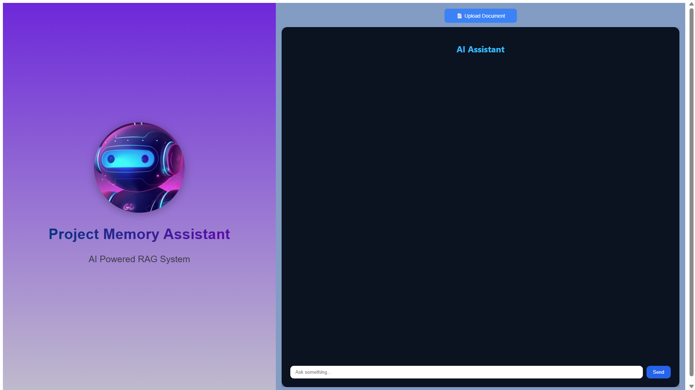
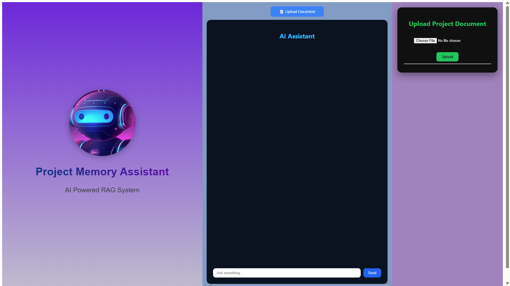
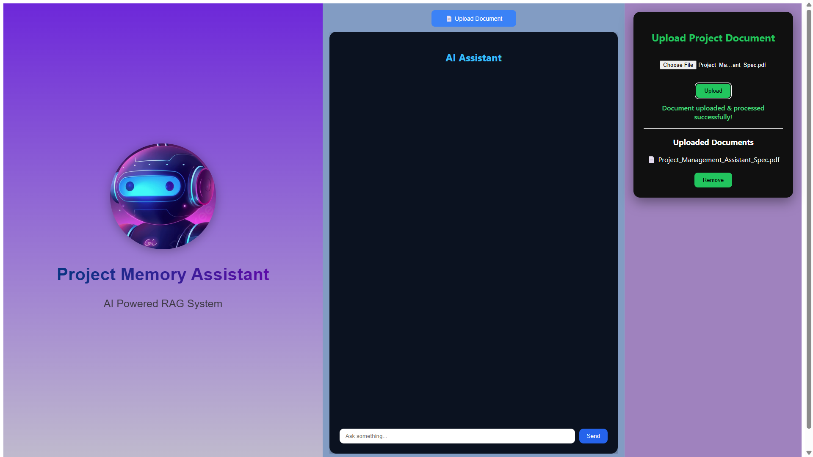
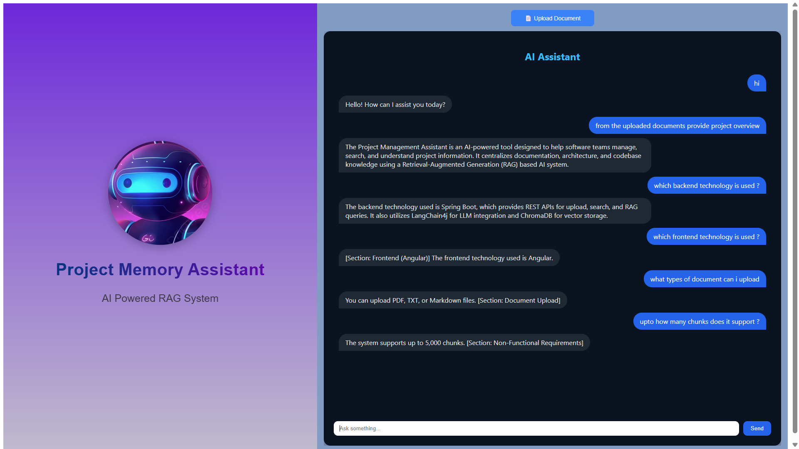

## 📘 Project Memory Assistant (RAG-based AI Application)

🔍 Overview

Project Memory Assistant is a Retrieval-Augmented Generation (RAG) based AI application designed to help users query and understand project-related documents such as requirements, architecture, and technical documentation.

Users can upload project documents, and the system answers questions based on the uploaded content, ensuring accuracy and preventing hallucinations.

This project demonstrates a complete end-to-end RAG pipeline using Spring Boot, Angular, LangChain4j, and ChromaDB.

## ✨ Key Features

📄 Upload project documents (PDF / text)

🧠 Automatic document chunking & embeddings

📦 Vector storage using ChromaDB

🔍 Semantic similarity search

💬 AI-powered chat interface

🔐 Data privacy–friendly architecture

## 🧠 How the RAG Pipeline Works

Document Upload

 - User uploads a project document via the Angular UI.

Text Extraction & Chunking

 - The document is split into overlapping text chunks to preserve context.

Embedding Generation

 - Each chunk is converted into vector embeddings using an OpenAI embedding model.

Vector Storage

 - Embeddings are stored in ChromaDB, a vector database.

Query Processing

 - User questions are embedded and matched against stored vectors using semantic similarity.

Context Injection

 - Top relevant chunks are injected into the LLM prompt.

Grounded Answer Generation

 - The AI responds using retrieved document context.

## 🏗️ Architecture

Angular Frontend

     |   
     v
Spring Boot REST API

     |
     
     |-- Document Upload & Processing
     
     |-- Embedding Generation (LangChain4j)
     
     |-- Semantic Search
     
     |
     
ChromaDB (Vector Store)

     |
     
OpenAI API (LLM + Embeddings)

## 🛠️ Tech Stack

Frontend

 - Angular 12.2.18

 - SCSS

 - TypeScript

Backend

 - Java 21

 - Spring Boot v 3.2.7

 - LangChain4j v 0.32.0

AI / Vector Store

 - OpenAI (LLM & Embeddings)

 - ChromaDB v 0.32.0

NOTE : chromdb-> to install need python  -> pip install chromadb -> chroma run --host 0.0.0.0 --port 8000

## 🖥️ Screenshots









## 🔐 Data Privacy Considerations

  - Uploaded documents are processed locally

 - Only embeddings are stored in the vector database

 - Raw documents are not sent to the LLM

 - Only relevant chunks are shared during query time

This design aligns with enterprise data privacy practices.

## ▶️ How to Run Locally

Prerequisites

Java 21

Node.js

Python (for ChromaDB)

OpenAI API key

Steps

 1. Start ChromaDB
    
```bash
pip install chromadb
chroma run --port 8000
```

2. Run Backend

```bash
export OPENAI_API_KEY=your_api_key
mvn spring-boot:run
```

3. Run Frontend

```bash
npm install
ng serve -o
```

4. Access Application

```bash
http://localhost:4200
```

📈 Future Enhancements

 - Multi-document and multi-project support

 - Persistent vector storage for cloud deployment

 - User authentication & access control

 - Chat history context

 - GitHub repository ingestion

 - Section-aware chunking for better summaries


